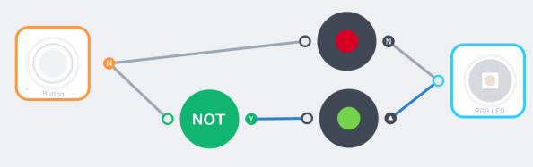
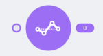
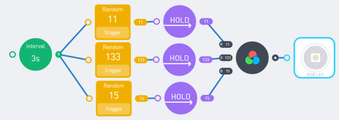

# Logic Nodes

## Compare

 
Compare the inputting number with a pre-configured number.

### How it is used

when you want something to happen if some value is above, below or equal a certain number. For example:  

- If the environment is overheated (temperature above a certain number), sound the alarm;  
- If the counter counts to 3, show a smiley face

### How it works
 

The input is the value to be compared. If the value satisfies the condition, the node will output “yes”; otherwise, it will output “no”.

 
When the temperature is over 30 (degrees Celsius), sound the buzzer.

### Tips: 

-	If the input is a string, the node will try to convert it to a number; if failed, the output will be “no”.
-	If the input is an object, the output will always be “no”
-	A hanging input yields “no”

## Number
 

Provide a number as a constant, or under a certain condition.

### How it is used

-	Set the parameter of another node. E.g., the rotation speed of a motor
-	Let another node’s parameter change to a certain value when something happens. E.g., when the heat is up, the fan motor rotates at a certain (higher) speed

### How it works
 

The number set in the config panel will be sent to the output. 
If an input is provided, the value is sent only if the input is “yes”; otherwise the output will be “no”.

Example: set the speed of the DC Motor Drive to 50

 
Example: When the value of the light sensor is above 50, set the motor speed to 70. 

## Compute

 
Make a certain arithmetic (+, -, *, /) operation on the input.

### How it is used

If you want your creation reacts to the slightest change in the room temperature, or you want the car moves, but have more juice when the color is blue, the “Compute” node comes to help. It can:
-	Amplify the input to a certain factor
-	Give an initial value of input by adding it to a constant number
-	Count numbers in a cycle by using the “mod” operator

### How it works 

Pick an operator(“+”, “-“, “*”, “/”) and an operand (the number you want to add or subtract with). The output will be the input compute with the configured operand.

 
Use the sound sensor value multiplied by 2 as the brightness of the RGB LED.

### Tips

-	If no input is provided (hanging input), the input will be considered 0
-	It will output Error if the input is not a number
-	If you want to use the input as the right-hand side of the operator, use COMPUTE+ node in the “Advanced“ tab.

## Interval
 

Flips the output repeatedly, at a certain interval. 

### How it is used

The output of the interval node flips between “yes” and “no” by itself. It is useful when:

-	You want to make a blinking light or a jiggling robot
-	You want to do something periodically, like taking a photo every 30 seconds

### How it works
 

In the config panel, choose the how many seconds before the result flips.

Example: making a blinking light

Example: making a “beep-beep” alarm when overheat

## Not

 
YES to NO and NO to YES.

### How it is used

Logical “NOT” stands for “if not”, “else” or “otherwise”. It flips the input from “yes” to “no” and “no” to “yes”. Useful in cases like:

-	Do something when the button is “NOT” pressed
-	If the Interval node is flipped to no, do something else

### How it works

Just attach the input, and get the opposite result.

Example: if the button is connected, turn red; otherwise, turn green

 
Color cycles between red and green

## And

 
YES if all inputs are YES.

### How it is used

The logical “AND” node outputs “yes” only when all the input sources say “yes”. It can be used in situations like:

-	If the room temperature is high “AND” it is past 6 o’clock, turn on the fan

### How it works
 

The “AND” node says “yes” when all the sources of input are considered “yes”.

 
On a hot evening (temperature is over 30 and current hour is over 17, 5pm in the evening), turn on the fan (hooked up to a motor). 

## Or

 
YES if any of the inputs is YES.

### How it is used

The logical “OR” node outputs “yes” if any of the input sources say “yes”. It can be used when:
-	If there is light (the drawer is open), sound the alarm; If the gyro is shaken (the creation is moved by somebody), also sound the alarm

### How it works

 
The “OR” node says “yes” whenever a source of the input is considered “yes”. 

 
Example: an alarming device that alarms when exposed to light (light sensor value > 30), or if it is moved (the gyro is shaken). 

Please note that the program above is equal to:

### Tips: 

-	In fact, you do not need an “OR” node very often because an “OR” logic is placed inside the input of most nodes. The example above is equal to this: 
 
## Toggle

 
Flip between YES and NO when activated.

### How it is used

The Toggle node flips between “yes” and “no”. You can use it to:
-	Convert a button to a switch. Push it, lights on (without the needs of keeping your finger on the button); push again, lights off.

### How it works
 
When the input changes from “no” to “yes”(we call it a “rising edge” in electric engineering), the output will flip between “yes” and “no”.

 
Example: use a button as a switch

## Counter

 
Plus one when activated.

### How it is used
The “Counter” node keeps a number for counting; it goes up each time the input flips from “no” to “yes”. This is useful when you want to:

-	Keep a number of something, like how may time the gyro is shaken
-	Make a stopwatch: count how many seconds did some event last
-	Make a timer: let something happen after a certain time period is passed

### How it works
 

When the input changes from “no” to “yes”(we call it a “rising edge” in electric engineering), the number displayed in the node will plus one, and goes to the output. 

If you push the “reset” button, the number will be reset to zero; the same will happen if the “RESET” input changes from “no” to “yes”.

 
Example: count the length of time when the room filled with people (using the PIR “people sensor”). The result is expressed in seconds.

### Tips: 
-	If you want to make a countdown, use the COMPUTE+ node like this:

 
Example: making a countdown

## Hold
 

Keep the input unchanged for a period of time

### How it is used
You can let buzzer sing a song whenever you shake the gyro. But as soon as the gyro is not shaken, the song will instantly stop. To let the song keep playing, you need to “HOLD” the “gyro is shaking” input for a period of time. This is when HOLD comes into the scene. It can:

-	Keep the input value, until another not “no” value comes in 
-	Keep the input value unchanged for a period of time
-	Let the input change gradually

### How it works
 

You can choose one of the three modes from the config panel: 

 
Hold until change: the input will be kept until another input comes in (such as a sad face replaces a smiley face). In other words, the output could be any value other than “no”. 
 

Example: change the color of the RGB LED with a FUNNY TOUCH (but do not turn off the light when untouched)

Hold for time: the input will stay the same for a period of time. In this period, any other input values will be ignored. If the hold period has been passed and the input is still “no”, the output will be set to “no”.

An alarming device that beeps 3 seconds after light detected.

Change Slowly: the output will change according to the input, but if the input is a number, every second the change will be no more than the specified number.

When the button is pressed, the light turns from green to red slowly (The number of the HOLD node’s config is set to 3).

## Delay

 
Make it happen after some time.

### How it is used:

Delay node will take an input, and send it to the output after a set period of time. It is useful when:

-	You want something happens after an event but after a period of time
-	You want something happens after an event, and after a period of time, some other thing happens after an event.

### How it works:
 
Every input will be sent to the output after a certain period of time (provided in the config panel).
 
When the button is pressed, rotate the motor, then rotate it reversely after 1 second.

### Tip:

-	An easy way to understand the “DELAY” node is: the output is always certain seconds behind the input.

## Average

 
Average over a period of time.

### How it is used

Imagine you want to build a device that alarms the mother whenever the baby cry, using the movement value (acceleration) detected by the gyro sensor. But if the alarm sounds every time there is little disturbance of the sensor (e.g. when the baby flips his/her arm), the mother will be crazy. Using the “average” node will let the result reflects the average of the input value over a period of time, filtering out noise data.

### How it works

The result will be the average value of the input over a period of time. You can set the period of time (engineers call that sampling window) you want to perform the average in the config panel.

 
Example: a “baby monitor” that alarms the mother when the baby cries (which makes the gyro shaken for a period of time. The Y Acceleration is used to represent shaking). 

### Tips:
-	A smaller sampling window means the output is more sensitive to the change of the input.

## Today

 
Get the date (year, month, day) today.

### How it is used
Node “TODAY” outputs today’s month, the day of the month, and day of the week. It can be used to:
-	Do something on a specific day

### How it works

There are 3 outputs in this node, and the meaning is straightforward: the day of the month(D), the month(M), and the day of the week(W) of today.

 
Example: light up the light strip on May the 4th

## Now

 
Get the hour, minute, and second now.

### How it is used

Node “NOW” outputs the current time, in the format of hour, minutes, and seconds. It can be used to:

-	Do something at a specific time of the day
-	Do something every second, every a few seconds or every minute.

### How it works
 

There are 3 outputs in this node, and the meaning is straightforward: the hour(H), the minute(M), and the second(S) of the current time.

 
Example: an alarm clock that buzzes for 10 seconds at 7:00

## Pulse

 
Make the output cycles over time.

### How it is used

The PULSE node’s output changes with the time according to the waveform specified in the config panel. It can be used to:

-	Make a “breathing” light/sound/movement effect; make the movement looks smooth

### How it works
 

In the settings panel, you can set the following parameters of the pulse generated:
 
-	Waveform: it can be “sin”, “square” and “triangle”. “Sin” waveform looks like breathing: it slows down at the top and bottom value. “Square” acts similar to the “INTERVAL” note, it turns on and off at each time period. “Triangle” is steadier(linear) when changing, but drives in the opposite way sharply when it reaches its maximum and minimum value.
-	Wavelength: the time in seconds that a pulse reaches its full cycle and starts to repeat itself.
-	Amplitude: the maximum value and (the negative) minimum value of the pulse 

Example: a breathing light

### Tips: 

-	If you want a pulse moves around some point other than zero, use the “COMPUTE” node.

## Sequence

 
Perform a series of actions according to their time.

### How it is used

The “SEQUENCE” node turns on each output one-by-one for a period of time. It can be used for:

-	Define an action as a series of moves. Such as shaking heads or waving hands
-	Perform a certain action when a certain condition is met

### How it works
  

Connect the action to the input of the SEQUENCE node; connect the moves to each of its outputs. Tap on the numbers on the node to set the duration of each output. And use the plus and minus sign to add/remove outputs.

Example: a traffic light that greens for 10 seconds, yellows for 3 seconds, and red for 30 seconds.

 
Example: when there is a person in front of the device (detected by the PIR sensor), nod head by repeatedly shaking the servo attached to port 1; otherwise, shake head by repeatedly shaking the servo attached to port 2.

## Random

 
Make an irregular output every time.

### How it is used

The RANDOM node can generate a random number. It is used to:
-	Make a dice, or make an effect that produces a different result every time.

### How it works
 
When the input flips from NO to YES, a random number will be sent to the output. You can change the range of the random number in the config panel.

 
Example: a light that changes its color randomly

## Scale
 

Map the input from a range to another.

### How it is used

-	Cases when the given input ranges from 0-100, but the output needs to be 0-255.
-	When the input changes too steadily or drastically, you can scale it to the range you want.

### How it works

 
Set two ranges from the config panel. The input will be scaled according to the set range. 

 
Example: make a thermometer. The temperature (0~50) is scaled to the angle of the servo (0~70) that has a needle stick on it that acts as a pointer.

### Tips:

-	You can use the Scale node to reverse a value. See the following example

Example: make a light that changes according to the temperature. When it is hot, it turns red; when it is cold, it turns blue. The first SCALE node scales the range of temperature to 0~255, the range of light color. The second SCALE node makes the “blue” value changes to the opposite direction of the red value. 

## Filter

 
Only output the input if it falls within the certain range.

### How it is used

-	Act differently when the input is in the different range. It makes your program more concise than using a bunch of COMPARE nodes.

### How it works

 
Set a range in the config panel. If the input falls in the range, output the input itself; otherwise, output NO.

 
Example: when the temperature is 0~20, turn green; when it is 20~30, turn yellow; when it is 30~40, turn red. 

## Function

 
Pass the input through a mathematical function.

### How it is used

-	In case you needs to do some mathematical operation, like rounding a number to its nearest integer, FUNCTION comes to help.

### How it works
 

 
Set the function you want to use in the config panel. The output will always be the input passing through the function you choose.
 
The settings panel of the function

 
Example: a knob that can set an integer number from 1 to 10

## Compute Plus

 
Make arithmetical operation on two inputs.

### How it is used

-	Make the result variates according to two input sources

### How it works

Set the operator(+, -, *, /) in the config panel. The result will be <the first input> <operator> <the second input>. For example, if you connect A to the upper input, B to the lower input, and the operator is -, then the result will be A-B

## Compare Plus

 
Compare the value of two input sources.

### How it is used

-	Make a comparison where all operands can change.
-	Use the value of a sensor or input device as the threshold of an alarm system

### How it works
 

Set the operator (>, <, =) in the config panel. Connect two operands to the input. The result will YES if the comparation condition is met. Otherwise it will output NO. 

 
Example: a light-sensor-based alarm device whose sensitivity is controlled by a knob

## Valve

Output some value if the condition is met.

### How it is used

-	“Conditional” nodes like COMPARE only outputs YES or NO; in case you want to output a value other than YES/NO, you will need the VALVE node.

### How it works
 
The upper input takes YES/NO; the lower input takes a value. If the upper input is YES, the lower input is sent to the node’s output; otherwise the node will output NO.

